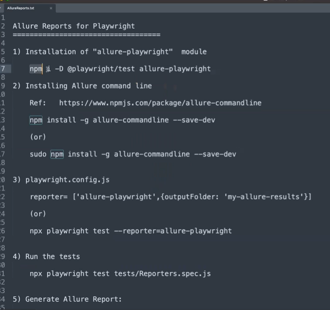
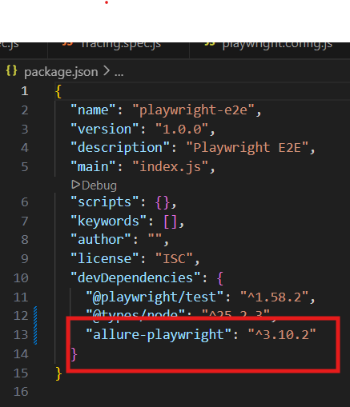
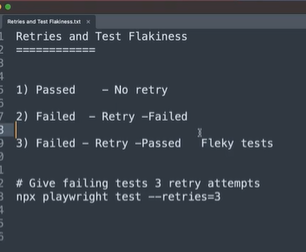
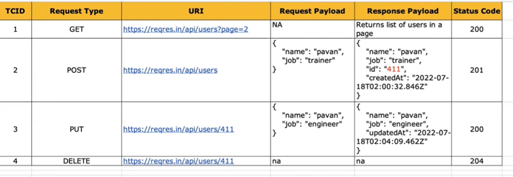
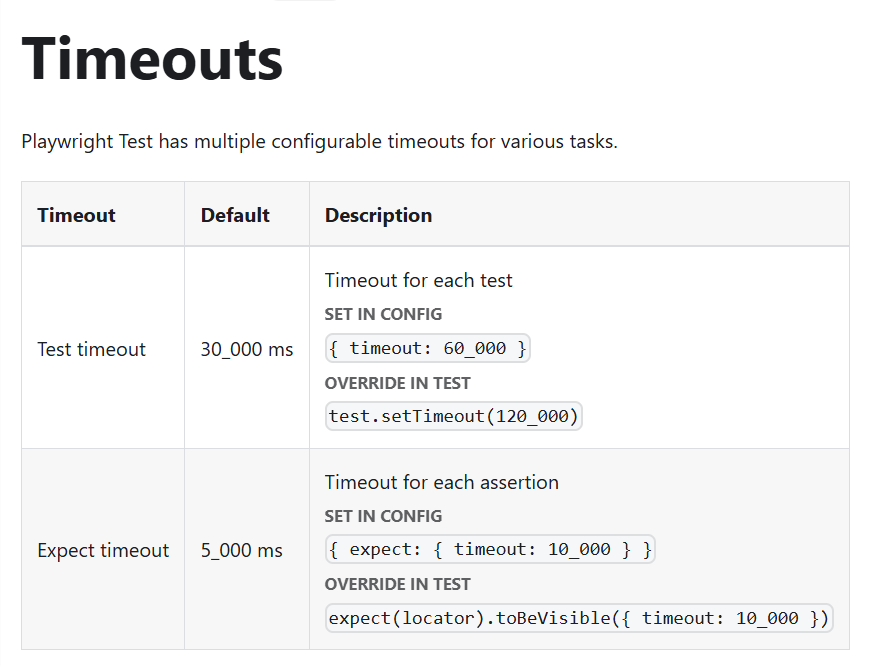
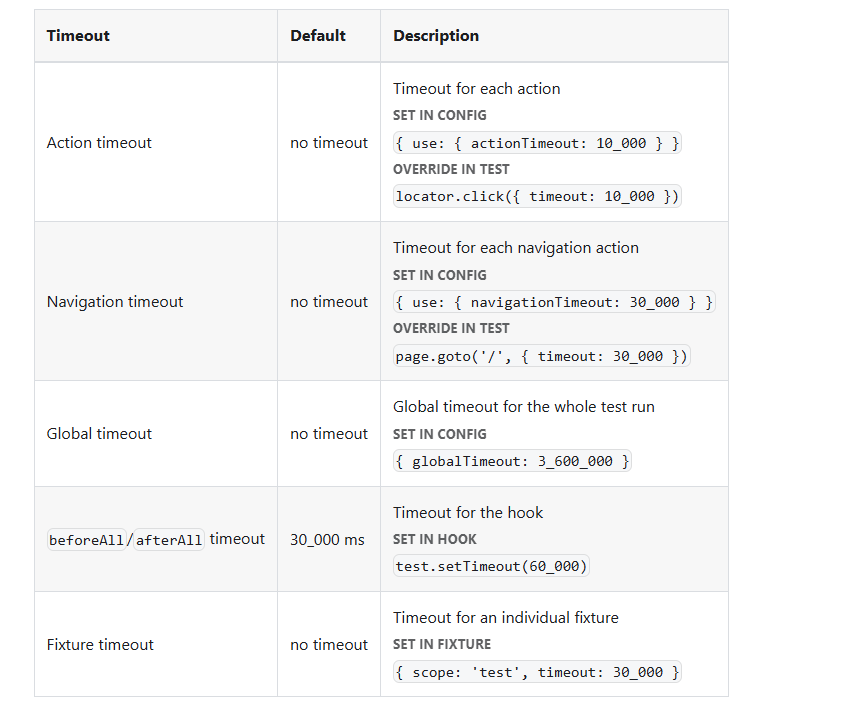

# Playwright-E2E
Playwright E2E

Playwright installation:
https://playwright.dev/docs/intro
node js
vs code

Install playwright:
1) Use command 'npm init playwright@latest'
2) Check playwright version installed using command: npm playwright -v
3) Choose language to use playwright Typescript/Javascript => By default its selected as TypeScript
4) Choose JS
5) Installation
    
    
6) Usefull Commands:
   
   
7) Project created:
   

8) Testfile example:
    

9) Files:    package.json => node project management file
   playwright.config.js => playwright configuration
   tests => we can all the playwright tests

  npm playwright -v => return installed version of playwright
  
  Playwright can be istalled from vscode plugin
10)  Command to run playwright tests: "npx playwright test"
 

11) By default tests are executed in headless mode. => Default command => npx playwright test
12) To executed tests in headed mode => Use command => npx playwright test --headed 

13) Report => 
   

14) Run playwright => npx playwright test (Headless Mode - Default) ; npx playwright test --headed (Headed Mode) ; npx playwright show-report (HTML Report)

15) To run specific test use command => npx playwright test HomePageTest.spec.js

16) Example =>            const {test, expect} = require ('@playwright/test');

test ('Home Page', async({page}) => {
    await page.goto('https://www.demoblaze.com/index.html');

    const pageTitle = page.title();
    console.log('Page title is:', pageTitle);

    await expect(page).toHaveTitle('STORE');

    const pageURL = page.url();
    console.log('Page URL is:', pageURL);

    await expect(page).toHaveURL('https://www.demoblaze.com/index.html');
    await page.close();
})

17) To test on specific browser for example chrome use command =>npx playwright test HomePageTest.spec.js --project=chromium

18) How to Create and Run Playwright Tests:

npx playwright test => runs all tests on all browsers in headless mode

npx playwright test MyTest.spec.js => runs a specific test file

npx playwright test MyTest.spec.js --project=chromium => runs on specific browser

npx playwright test MyTest.spec.js --project=chromium --headed => runs in headed mode

npx playwright test Mytest.spec.js --project=chromium --headed --debug => runs in debug mode

19) **Locating Elements in Playwright**

property
css
xpath

Locate single element =>

link/button =>

await page.locator('locator').click()
await page.click('locator');

inputbox =>

await page.locator('locator').fill('value')
await page.locator('locator').type('value')

await page.fill('locator', 'value')
await page.type('locator', 'value') 

Locate multiple web elements =>

const elements = await page.$$(locator)

Multiple Locators => 

20) **Built - in locators** =>

page.getByRole() to locate by explicit and implicit accessibility attributes.

page.getByText() to locate by text content.

page.getByLabel() to locate a form control by associated label's text.

page.getByPlaceholder() to locate an input by placeholder.

page.getByAltText() to locate an element, usually image, by its text alternative.

page.getByTitle() to locate an element by its title attribute.

page.getByTestId() to locate an element besed on its data - testid attribute.

URL = https://playwright.dev/docs/locators

21) **Test generator: Codegn** => automatically generate test and locators.

npx playwright codegen -o tests/mytest.spec.js

npx playwright codegen --target javascript

npx playwright codegen --browser chromium

npx playwright codegen --device "iPhone 13"

List of devices supported => use command for ex: npx playwright codegen --device "iPhone12"

 
Viewport =>

npx playwright codegen –viewport-size “1280, 720”   --> for x & y coordinates

URL: https://playwright.dev/docs/codegen 

  
11) Assertions =>
Hard nd Soft Assertions

12) Actions =>
Checkboxes and Radio Buttons =>
Using locator.setChecked() is the easiest way to check and uncheck a checkbox or a radio button. This method can be used with input[type=checkbox], input[type=radio] and [role=checkbox] elements
URL: https://playwright.dev/docs/input

await page.locator("//input[@value='female']").check(); //female
    //await page.check("//input[@value='female']");
    await page.getByLabel("Female").check();
    expect(await page.getByLabel("Female")).toBeChecked();
    await expect(await page.locator("//input[@value='female']")).toBeChecked();
    await expect(await page.locator("//input[@value='female']").isChecked()).toBeTruthy();//female

    await expect(await page.locator("//input[@value='male']").isChecked()).toBeFalsy();//male

13) Keyboard => https://playwright.dev/docs/api/class-keyboard

An example of pressing uppercase A

await page.keyboard.press('Shift+KeyA');
// or
await page.keyboard.press('Shift+A');

An example to trigger select-all with the keyboard

await page.keyboard.press('ControlOrMeta+A');

Use Control for Windows machine OS
Use Meta for MAC machine OS

    //Ctrl + A ---> Select the text
    await page.keyboard.press('Control+A')
    //for MAC OS machine use Meta+A

    
    //Ctrl + C ---> Copy the text
    await page.keyboard.press('Control+C')

    //Tab ---> Tab
    await page.keyboard.down('Tab')
    await page.keyboard.up('Tab')

    //Ctrl + V  ---> Paste the text
    await page.keyboard.press('Meta+V')

14) Playwright Hooks:

beforeEach: This hook is executed before each individual test.
afterEach: This hook is executed after ecah individual test.

beforeAll: This hook is executed once before any of the tests start running.
afterAll: This hook is executed once after all the tests have been run.

15) Screenshot:
Timestamp: Date.now

For ex:
await page.screenshot({ path: 'tests/screenshots/'+ Date.now() + 'HomePage.png'})

await page.screenshot({ path: 'tests/screenshots/' + Date.now() + 'FullPage.png', fullPage:true})

await page.locator('//h4/a[normalize-space()="MacBook"]').screenshot({ path: 'tests/screenshots/' + Date.now() + 'MacBook.png'})

add screenshot: 'on' in playwright.conf file to capture screenshot of all the tests

1) use .screenshot() => to take screenshot for file level/locator
2) add screenshot: on in playwright.conf file under use{} section to get screenshot of all the test runs by default in reports. And use command npx playwright show-report

16) Video: and in playwright.config file
video: "on" / video: "retain-on-failure",

17) Trace: and in playwright.config file
trace: 'on-first-retry', / trace: 'retain-on-failure',

Refer: https://playwright.dev/docs/trace-viewer

Command to trace file => npx playwright show-trace path/to/trace.zip

18) Tags:
@smoke for critical functionality tests

@regression for tests that ensure new changes don’t break existing functionality

@critical for high-priority tests that must pass to ensure the application is stable

commands=> grep will include while --grep-invert will exclude.

npx playwright test tests/Tags.spec.js --project chromium --headed --grep @sanity

npx playwright test tests/Tags.spec.js --project chromium --grep @sanity --grep-invert @reg  

19) Annotations:

test.skip() marks the test as irrelevant. Playwright does not run such a test. Use this annotation when the test is not applicable in some configuration.

test.fail() marks the test as failing. Playwright will run this test and ensure it does indeed fail. If the test does not fail, Playwright will complain.

test.fixme() marks the test as failing. Playwright will not run this test, as opposed to the fail annotation. Use fixme when running the test is slow or crashes.

test.slow() marks the test as slow and triples the test timeout.

Refer: https://playwright.dev/docs/test-annotations 

20) Page Object Models:

21) Reporters: https://playwright.dev/docs/test-reporters

reporter: 'html', //'list', //'line',

 reporter: [['json', {outputFile: 'results.json'}]],

 reporter: [['junit', {outputFile: 'results.xml'}]],

  OR for multiple reporters =>
  reporter: [['list'],
  ['html'],
  ['junit', {outputFile: 'results.xml'}],
  ['json', {outputFile: 'results.json'}]
  ],

Refer => https://playwright.dev/docs/api/class-reporter

22) Allure Reports for Playwright => https://www.npmjs.com/package/allure-playwright 

Command to install: npm install -D allure-playwright
and check on installing its present under package.json file. 

 

 reporter: [['list'],
  ['html'],
  ['junit', {outputFile: 'results.xml'}],
  ['json', {outputFile: 'results.json'}],
  ['allure-playwright', {outputFolder: 'my-allure-results'}]
  ],

Refer => https://www.npmjs.com/package/allure-playwright

Command =>
allure generate ./allure-results -o ./allure-report
allure open ./allure-report

23) Retries and Test Flakiness

retries: process.env.CI ? 2 : 0,
retries: 1,

Refer => https://playwright.dev/docs/test-retries#retries

# Give failing tests 3 retry attempts
npx playwright test --retries=3

24) Rest API Testing:

Set 'fullyParallel: false,' in playwright.config.js file => To run test as per priority or listed order as provided.

## Course ##

# Timeouts: https://playwright.dev/docs/test-timeouts
By default test timeout is 30 sec and expect timeout is 5 sec.

Advanced: low level timeouts =>

Assertions
expect(success).toBeTruthy();

await expect(page.getByTestId('status')).toHaveText('Submitted');

Auto-retrying assertions
Assertion	Description
await expect(locator).toBeAttached()
Element is attached
await expect(locator).toBeChecked()
Checkbox is checked
await expect(locator).toBeDisabled()
Element is disabled
await expect(locator).toBeEditable()
Element is editable
await expect(locator).toBeEmpty()
Container is empty
await expect(locator).toBeEnabled()
Element is enabled
await expect(locator).toBeFocused()
Element is focused
await expect(locator).toBeHidden()
Element is not visible
await expect(locator).toBeInViewport()
Element intersects viewport
await expect(locator).toBeVisible()
Element is visible
await expect(locator).toContainText()
Element contains text
await expect(locator).toContainClass()
Element has specified CSS classes
await expect(locator).toHaveAccessibleDescription()
Element has a matching accessible description

await expect(locator).toHaveAccessibleName()
Element has a matching accessible name

await expect(locator).toHaveAttribute()
Element has a DOM attribute
await expect(locator).toHaveClass()
Element has specified CSS class property
await expect(locator).toHaveCount()
List has exact number of children
await expect(locator).toHaveCSS()
Element has CSS property
await expect(locator).toHaveId()
Element has an ID
await expect(locator).toHaveJSProperty()
Element has a JavaScript property
await expect(locator).toHaveRole()
Element has a specific ARIA role

await expect(locator).toHaveScreenshot()
Element has a screenshot
await expect(locator).toHaveText()
Element matches text
await expect(locator).toHaveValue()
Input has a value
await expect(locator).toHaveValues()
Select has options selected
await expect(locator).toMatchAriaSnapshot()
Element matches the Aria snapshot
await expect(page).toMatchAriaSnapshot()
Page matches the Aria snapshot
await expect(page).toHaveScreenshot()
Page has a screenshot
await expect(page).toHaveTitle()
Page has a title
await expect(page).toHaveURL()
Page has a URL
await expect(response).toBeOK()
Response has an OK status

Non-retrying assertions

Assertion	Description
expect(value).toBe()
Value is the same
expect(value).toBeCloseTo()
Number is approximately equal
expect(value).toBeDefined()
Value is not undefined
expect(value).toBeFalsy()
Value is falsy, e.g. false, 0, null, etc.
expect(value).toBeGreaterThan()
Number is more than
expect(value).toBeGreaterThanOrEqual()
Number is more than or equal
expect(value).toBeInstanceOf()
Object is an instance of a class
expect(value).toBeLessThan()
Number is less than
expect(value).toBeLessThanOrEqual()
Number is less than or equal
expect(value).toBeNaN()
Value is NaN
expect(value).toBeNull()
Value is null
expect(value).toBeTruthy()
Value is truthy, i.e. not false, 0, null, etc.
expect(value).toBeUndefined()
Value is undefined
expect(value).toContain()
String contains a substring
expect(value).toContain()
Array or set contains an element
expect(value).toContainEqual()
Array or set contains a similar element
expect(value).toEqual()
Value is similar - deep equality and pattern matching
expect(value).toHaveLength()
Array or string has length
expect(value).toHaveProperty()
Object has a property
expect(value).toMatch()
String matches a regular expression
expect(value).toMatchObject()
Object contains specified properties
expect(value).toStrictEqual()
Value is similar, including property types
expect(value).toThrow()
Function throws an error
Asymmetric matchers

Matcher	Description
expect.any()
Matches any instance of a class/primitive
expect.anything()
Matches anything
expect.arrayContaining()
Array contains specific elements
expect.arrayOf()
Array contains elements of specific type
expect.closeTo()
Number is approximately equal
expect.objectContaining()
Object contains specific properties
expect.stringContaining()
String contains a substring
expect.stringMatching()
String matches a regular expression

