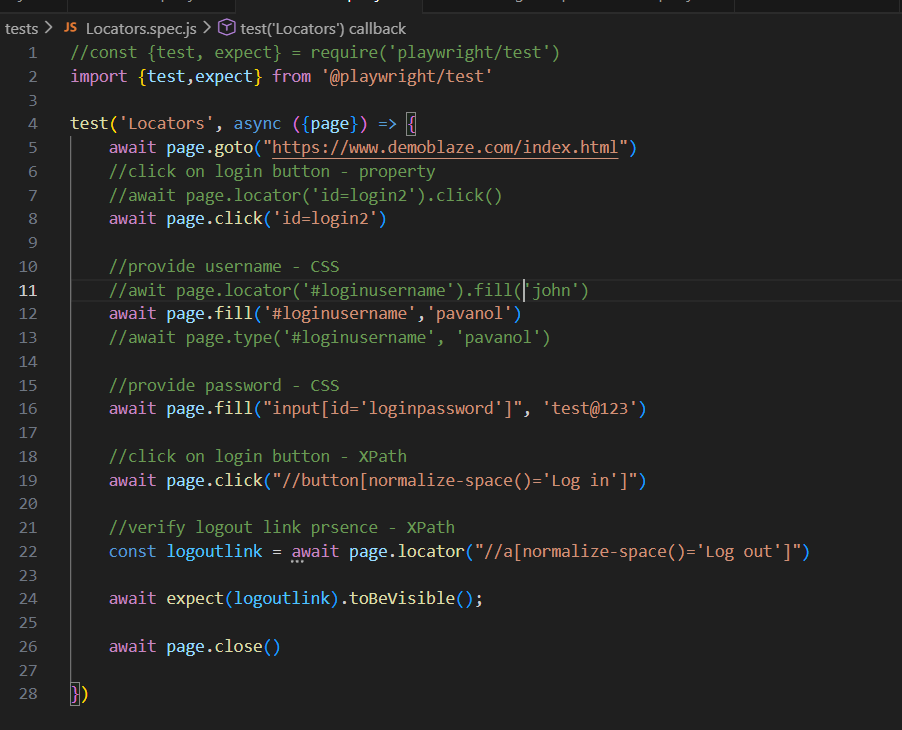
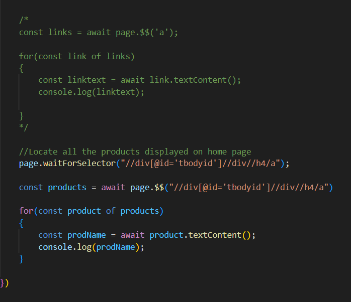
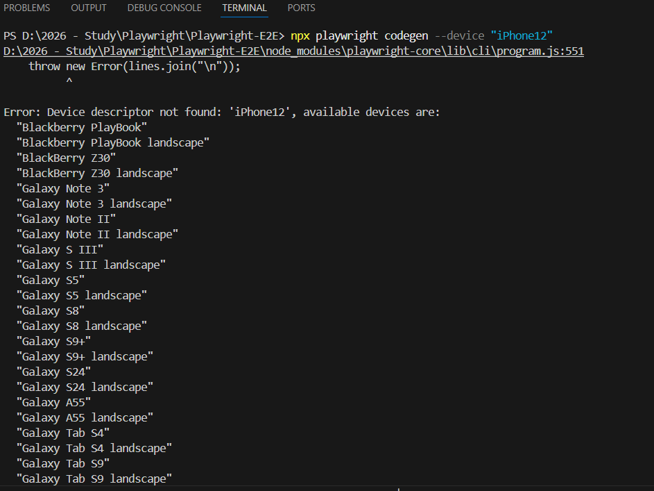

# Playwright-E2E
Playwright E2E

Playwright installation:
https://playwright.dev/docs/intro
node js
vs code

Install playwright:
1) Use command 'npm init playwright@latest'
2) Check playwright version installed using command: npm playwright -v
3) Choose language to use playwright Typescript/Javascript => By default its selected as TypeScript
4) Choose JS
5) Installation
    
    
6) Usefull Commands:
   
   
7) Project created:
   

8) Testfile example:
    

9) Files:    package.json => node project management file
   playwright.config.js => playwright configuration
   tests => we can all the playwright tests

  npm playwright -v => return installed version of playwright
  
  Playwright can be istalled from vscode plugin
10)  Command to run playwright tests: "npx playwright test"
 

11) By default tests are executed in headless mode. => Default command => npx playwright test
12) To executed tests in headed mode => Use command => npx playwright test --headed 

13) Report => 
   

14) Run playwright => npx playwright test (Headless Mode - Default) ; npx playwright test --headed (Headed Mode) ; npx playwright show-report (HTML Report)

15) To run specific test use command => npx playwright test HomePageTest.spec.js

16) Example =>            const {test, expect} = require ('@playwright/test');

test ('Home Page', async({page}) => {
    await page.goto('https://www.demoblaze.com/index.html');

    const pageTitle = page.title();
    console.log('Page title is:', pageTitle);

    await expect(page).toHaveTitle('STORE');

    const pageURL = page.url();
    console.log('Page URL is:', pageURL);

    await expect(page).toHaveURL('https://www.demoblaze.com/index.html');
    await page.close();
})

17) To test on specific browser for example chrome use command =>npx playwright test HomePageTest.spec.js --project=chromium

18) How to Create and Run Playwright Tests:

npx playwright test => runs all tests on all browsers in headless mode

npx playwright test MyTest.spec.js => runs a specific test file

npx playwright test MyTest.spec.js --project=chromium => runs on specific browser

npx playwright test MyTest.spec.js --project=chromium --headed => runs in headed mode

npx playwright test Mytest.spec.js --project=chromium --headed --debug => runs in debug mode

19) **Locating Elements in Playwright**

property
css
xpath

Locate single element =>

link/button =>

await page.locator('locator').click()
await page.click('locator');

inputbox =>

await page.locator('locator').fill('value')
await page.locator('locator').type('value')

await page.fill('locator', 'value')
await page.type('locator', 'value') 

Locate multiple web elements =>

const elements = await page.$$(locator)

Multiple Locators => 

20) **Built - in locators** =>

page.getByRole() to locate by explicit and implicit accessibility attributes.
page.getByText() to locate by text content.
page.getByLabel() to locate a form control by associated label's text.
page.getByPlaceholder() to locate an input by placeholder.
page.getByAltText() to locate an element, usually image, by its text alternative.
page.getByTitle() to locate an element by its title attribute.
page.getByTestId() to locate an element besed on its data - testid attribute.

URL = https://playwright.dev/docs/locators

21) **Test generator: Codegn** => automatically generate test and locators.

npx playwright codegen -o tests/mytest.spec.js

npx playwright codegen --target javascript

npx playwright codegen --browser chromium

npx playwright codegen --device "iPhone 13"

List of devices supported => use command for ex: npx playwright codegen --device "iPhone12"

 
Viewport =>

npx playwright codegen –viewport-size “1280, 720”   --> for x & y coordinates

URL: https://playwright.dev/docs/codegen 

  
11) 

